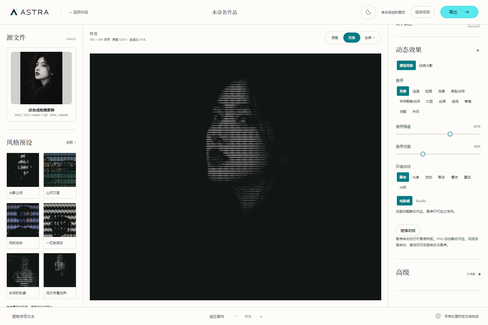

# 空闲调度与提示验证

对应[阶段记录](../../../plans/preview-feedback-idle-2026-10-05.md)。原始实验、HTML 和媒体文件保留于忽略的 `test-results/`；本目录只归档精简报告和完成后的页面截图。

| 证据 | 范围 |
| --- | --- |
| [修复前](./reproduction-before.json)、[初始修复后](./reproduction-after.json) | 无延迟注入的真实 180 列生产探针：静止重复请求和提示 |
| [光晕密集探针](./light-dense-before.json) | 时钟修复前最终像素零差，但完整归位流程很长 |
| [UI Chrome](./ui-chrome.json)、[UI Edge](./ui-edge.json) | 生产图片、真实输入、精确恢复、主题缩放、全屏、环境、换图；完成 bitmap 投递延迟 600ms，仅用于确定性加载反馈 |
| [UI R1](./ui-r1-enum-failure.json)、[R2](./ui-r2-light-recovery-failure.json)、[R3](./ui-r3-observation-failure.json) | 保留枚举误断言、真实光晕超时、固定观察窗不足及各轮局部通过范围 |
| [光晕 Chrome](./light-clock-chrome.json)、[Edge](./light-clock-edge.json) | alpha/coverage-zero 算法状态与真实 Worker 输入；另有真实字形断网 HTML 的延迟调度、可见光晕及精确恢复 |
| [聚散 Chrome](./particle-clock-chrome.json)、[Edge](./particle-clock-edge.json) | 数值、真实 Worker、补算心跳、事件回放与取消；不作画质/FPS证据 |
| [Watchdog Chrome](./watchdog-chrome.json)、[Edge](./watchdog-edge.json) | 各 23 项虚拟故障，合法补算及无效进度拒绝，不作真实性能结论 |
| [图片 Chrome](./image-chrome.json) | 80 项冻结 RGBA、metadata、取消、配置替换、回退、全屏及缩放 |
| [视频 Chrome](./video-chrome.json)、[Edge](./video-edge.json) | 冻结采样/Worker RGBA、六模式本地短视频、暂停、预解析、全屏及兼容路径；rAF 不是字符帧 FPS |
| [视频反馈首轮失败](./video-feedback-initial-failure.json)、[追加诊断](./video-feedback-buffering-diagnosis.json) | 首轮未采集提示文字；追加样本明确是实际媒体等待，原生成断言覆盖范围过宽 |
| [视频反馈 Chrome](./video-feedback-chrome.json)、[Edge](./video-feedback-edge.json) | 明暗/桌面/手机布局、减少动效、真实连续媒体与延迟 bitmap、生成提示零样本；waiting/canplay 部分为合成事件 |

复验入口为 `npm run test:preview-feedback`、`npm run test:light-clock`、`npm run test:video-render-feedback`、`npm run test:art-render-watchdog`、`npm run test:particle-clock`、`npm run test:image-responsive`、`npm run test:video-responsive`。UI 默认用生产 preview 5184；算法/冻结模块默认用 dev 5180。可用 `ASTRA_BROWSER_CHANNEL=chrome/msedge`、相应输出环境变量指定浏览器及独立报告目录。视频反馈可在干净检出生成原生 WebM，生成素材与外部 MP4 的范围分别保留。
