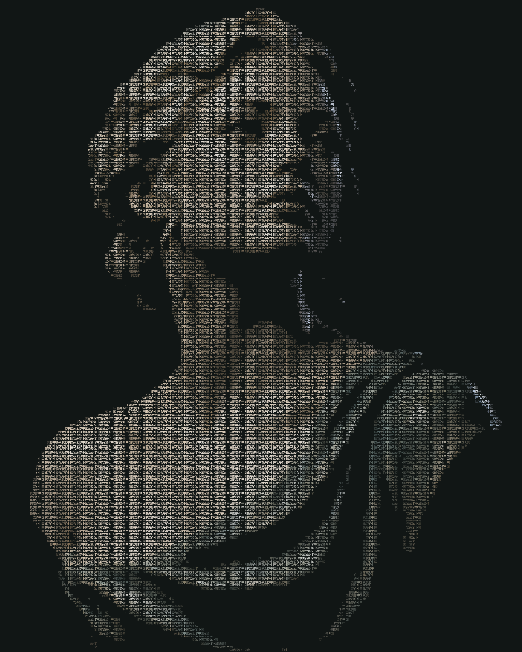

# 真实编辑器区域缓存研究证据

对应[阶段记录](../../../plans/preview-region-page-research-2026-10-05.md)。生产页面/工厂未改，候选只在隔离浏览器的真实 Worker 中使用；源代码和打包结果保存在忽略的 `test-results/`，可用 `npm run research:preview-region-page` 重建。

| 报告 | 范围 |
| --- | --- |
| [Edge 初轮](./edge-initial-paired.json) | 原色及默认单色中文、聚散/光晕、原模块/候选真实操作；中文部分没有明确颜色设置，不能外推彩色中文 |
| [Edge 彩色中文假设失败](./edge-colored-no-patch-failure.json) | 原生工厂没有失败；候选六幅重放零差、实际强反馈/精确恢复通过，但广域手势没有 patch，错误的必有 patch 研究断言失败 |
| [Edge 彩色中文补测](./edge-colored-final.json) | 明确 `colored: true`、原始 settings、真实时间与请求、广域完整绘制、原模块/候选；不把偶发 early patch 当持续收益 |
| [Edge 其它模式与边界](./edge-controls.json) | 其余四模式真实 180 列及请求重放；双主题缩放、取消/换图、四品质、全屏、暂停、减少动效、离页释放、390px 180列触控 |
| [Chrome 配对](./chrome-paired-final.json) | 原色与明确彩色中文、聚散/光晕、真实高密度操作、实际请求重放 |
| [Chrome 其它模式与边界](./chrome-controls-final.json) | 与 Edge 对应的实际操作/品质/触控及释放；附录屏 metadata |
| [汇总](./summary.json) | 选取最终彩色范围及其它模式/品质，Edge 112、Chrome 111 幅重放零差；不把最初单色中文和假设失败混入最终统计 |

[真实 Canvas 录屏](./editor-density-particles.webm)记录 Chrome 光影模式候选的一次实际鼠标操作；[解码检查](./recording-decode.json)验证 571 × 713、5.356 秒实际播放至结束且画面变化。它是候选工程证据，未接入生产或通过商业速度验收。

真实鼠标路径为 18 步横跨 `.15 → .85` 的 S 形路径，步间等待 25ms；实际浏览器/绘制耗时会影响合并输入。聚散仍要求 peak > `.005`、可见 PNG 改变，离开后 60 秒内 PNG 精确恢复。静止观察窗口 1.5 秒零新请求，普通交互反馈每 40ms 采样为零；真正尺寸/来源变化继续保留必要提示。

每个上下文只保存有限 bitmap，重放从该 Worker 的首请求开始；不是手工重建 Vue 状态。请求重放的每个 RGBA 通道都必须零差；实际页面的不透明范围与上一阶段透明离线范围分别记录。首个可见反馈/退场是含 QA 记录开销的一次观察，不能作字符 FPS。触控是浏览器 CDP 输入，不是实体手机性能验收。

环境变量：`ASTRA_BROWSER_CHANNEL=chrome/msedge`、`ASTRA_PREVIEW_URL`（默认生产 preview 5184）、`ASTRA_REGION_PAGE_OUTPUT`、`ASTRA_REGION_PAGE_MODES`（逗号分隔模式）、`ASTRA_REGION_PAGE_HOVERS=particles,light`、`ASTRA_REGION_PAGE_SIDES=baseline,candidate`。`ASTRA_REGION_PAGE_BOUNDARIES=1` 附加操作/品质/触控；`ASTRA_REGION_PAGE_ONLY_BOUNDARIES=1` 只运行该部分。`ASTRA_REGION_PAGE_RECORD=1` 额外记录候选光影模式的实际画布，30次/秒只是请求采集频率，录制有开销且不证明字符帧率。
