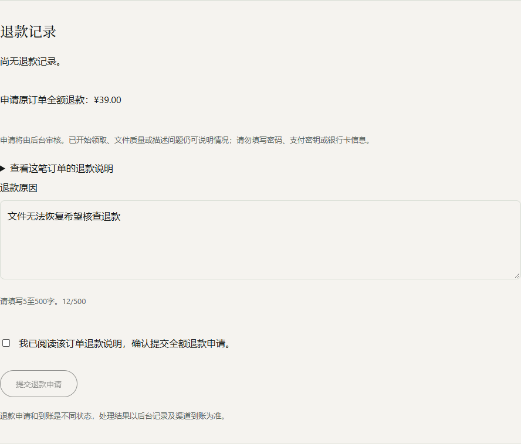
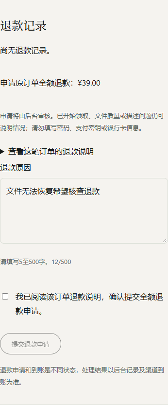
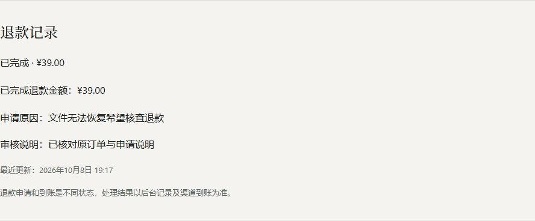

# 本人退款申请与后台审核联调证据

2026-10-08。范围/复跑/故障见[前端阶段](../../../plans/refund-application-2026-10-08.md)和[后台阶段](../../../../../astra-cloud/docs/plans/refund-application-2026-10-08.md)。模拟资金与专用fixtureJWT；auth/me明确503模拟，主库/Nacos/生产角色未变。

新阶段11真实JUnit、10浏览器检查、137实际HTTP复核；相关worker12+配置4回归通过。前端新恢复合同10项、既有首付款9/恢复10项、type-check/相关ESLint/最终build通过。各次范围见summary.json和junit.json；HTTP及浏览器详情/源码绑定见对应JSON。截图是桌面及390px模拟视口，不当真机、真实资金或整个产品审美验收。

申请表单默认未勾选，原因/原金额和条款可读；实际响应丢失后同键恢复一份记录，后台实际审批/可信退款之后读取SUCCEEDED/REVOKED与审核说明。审批审计trigger失败整体回滚、数据库/Redis故障503和越权/版本/签名游标/限流拒绝均在独占基础设施验证。







资金/渠道/会员/后台工作台/每日对账、真实登录和正式部署仍待完成。原始日志保留本地tmp，精简归档不含JWT、票据、checkout、真实申诉文本或基础设施密码。所有测试用户与理由为合成夹具，独占schema/Redis/gateway已清理。源manifest统一CRLF→LF，支持worktree/index/commit核对：

```powershell
python scripts/validate-refund-application-evidence.py --evidence ../astra-web/docs/validation/2026-10-08/refund-application/http-evidence.json --manifest ../astra-web/docs/validation/2026-10-08/refund-application/source-manifest.json --source-mode commit --output ../tmp/新的退款源核验.json
```
